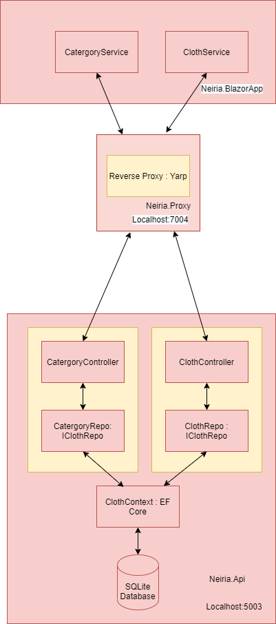

# Neiria - small E-Commerce project

# What is it?
An e-commerce project where users can search for clothes, buy them and find information about it. For this project the .NET Core framework (Web Api and Blazor) and programming language C# are used to create this e-commerce project. 

# Backend Project

The project is a WEB API project written in .NET Core 3.1

The project has different layers that are :

### Api

In the Api layer you'll find the different controllers that will be called with REST. 

### Application

The Application layer contains services that can be injected in the project with Dependency injection.

### Domain

The Domain layer contains the different models and interfaces that can be used in the project

### Infrastructure 

The Infrastructure layer contains the business logic and communicating with the database for the application. 

# Architecture of the project

# Built With
- C# 
- ASP.NET Core 5.0  
- Entity Framework Core
- SQLite 
- Yarp - Yet another reverse proxy for creating a proxy server
- Blazor - interactive UI using C# code in HTML
